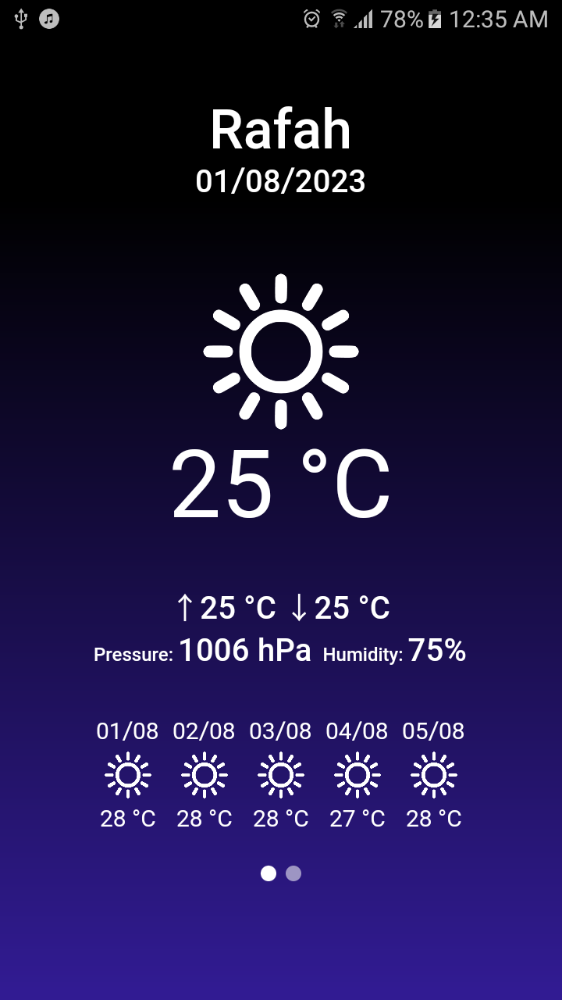
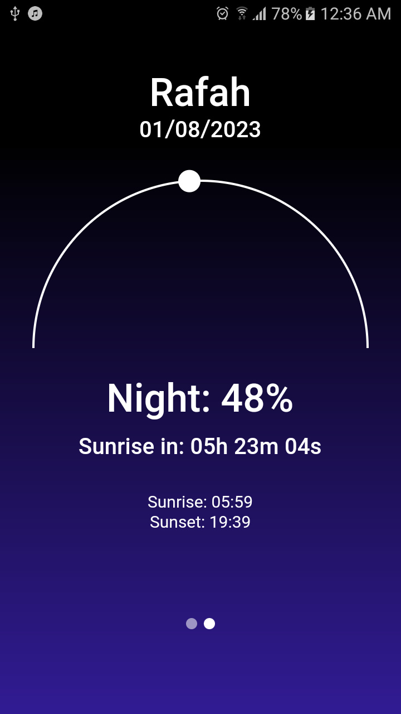

# Feather

A Flutter project to view current weather status.

## Features

- Beautiful UI
- Current weather: current temperature, max and min temperature, humidity, pressure
- Weather forecast for 5 days  (temperature, wind, rain and pressure)
- Sun/moon animation
- App background based on day cycle
- Automatically picks user location (also error handling when location can't be selected!)
- Persist location and weather data in local storage
- Works offline (user need to download data before)
- Automatically refresh data every 15 minutes
- Bloc architecture, Dio

## Screenshots

<table>
  <tr> 
    <td> 
          
    </td>
    <td>
        
    </td>
</tr> 
</table>